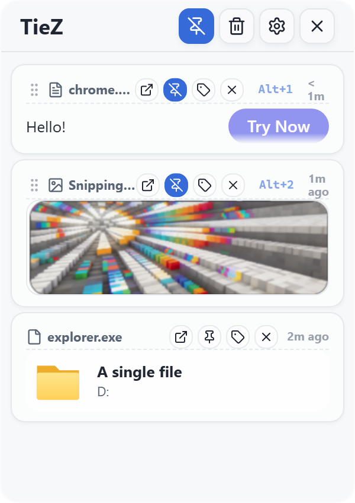
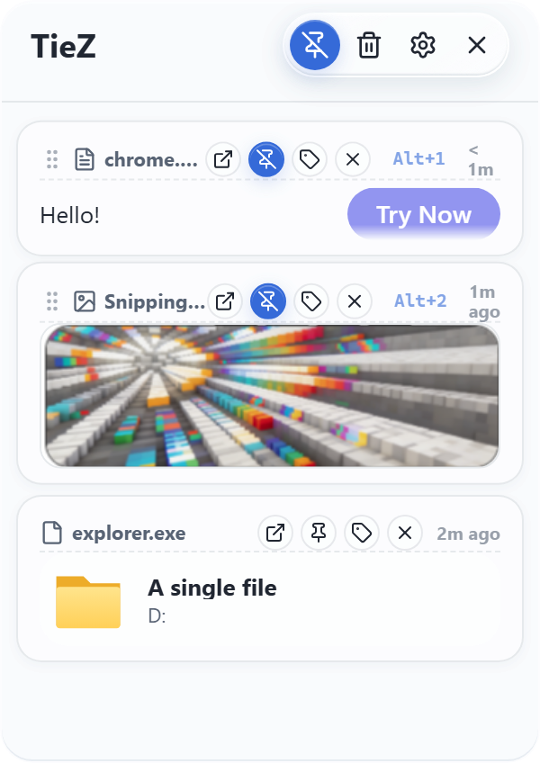
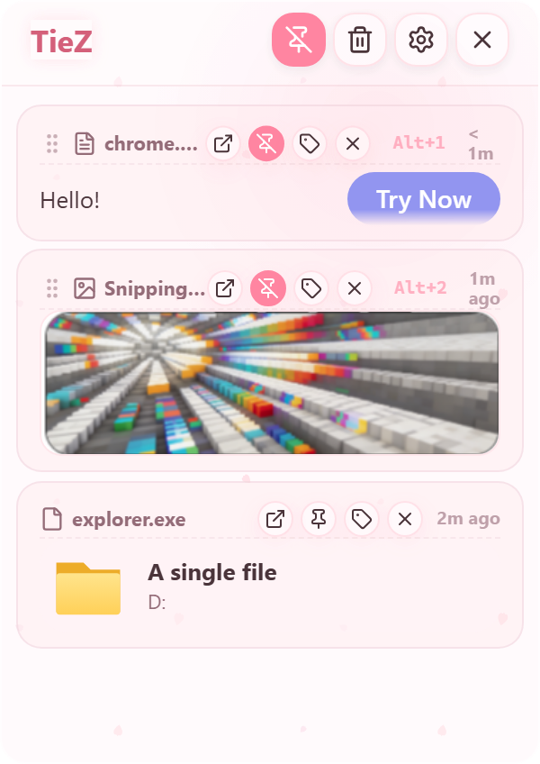

  
  <b>Making fragmented information flow effortlessly.</b>

---

  

  ### **STAY FAST. STAY LOCAL.**

  | STARS | VERSION | LICENSE | PLATFORM |
  | :--- | :--- | :--- | :--- |
  |  |  |  |  |

  [English](./README.md) | [简体中文](./README.zh-CN.md)

---

## Theme Gallery

Explore 7 built-in themes designed for different workspaces and workflows.

  <table>
    <tr>
      <td align="center"><b>Frosted Glass</b> </td>
      <td align="center"><b>Notebook Style</b> </td>
      <td align="center"><b>Sticky Note</b> </td>
      <td align="center"><b>3D Interaction</b> </td>
    </tr>
  </table>
  <table>
    <tr>
      <td align="center"><b>Mica</b> </td>
      <td align="center"><b>Liquid Glass</b> </td>
      <td align="center"><b>Sakura</b> </td>
    </tr>
  </table>

---

## Why TieZ?

| Performance | Practicality | Privacy | Appearance |
| :--- | :--- | :--- | :--- |
| **Instant Access** Native listeners and a Rust core for quick access to your clipboard. | **Power Workflows** Rich text, multi-color tags, search, and sequential paste. | **Local & Private** Local history storage with masking for sensitive data in previews. | **Make It Yours** Seven built-in themes, light and dark modes, and adjustable Liquid Glass effects. |

---

## Key Features

### Core Experience

- **Native Efficiency**: Built with Tauri 2 and Rust for minimum memory footprint.
- **Smart Capture**: Automatically collects text, rich text (HTML), images, and file paths.
- **Modern UI**: **7 built-in themes**, including refreshed Mica/Acrylic effects and Liquid Glass, with light and dark modes.
- **Liquid Glass Controls**: Adjust clarity (0–100%) and control backdrop blur (0–32px) in Appearance settings.
- **Edge Docking**: Automatically hides at the screen edge to stay out of your way.

### Management & Enhancements

- **Tag System**: Organize your history with custom multi-color tags.
- **Emoji Library**: Comprehensive built-in emoji management for quick access.
- **Advanced Settings**: Granular control over cleanup rules and app behavior.
- **Privacy Masking**: Auto-masks sensitive info like IDs and phone numbers in previews.

### Productivity Tools

- **External Editing**: Open items in external editors and save changes back to local history.
- **Global Search**: Find records by content, source app, or tag.
- **Sequential Paste**: Optimized workflow for high-frequency copy-paste tasks.

---

## Installation

### Platform Support

| Platform | Requirement | Output |
| :--- | :--- | :--- |
| **Windows** | Windows 10/11 (x64) *(Windows 11 Recommended)* | `.exe` / **`.zip` (Portable)** |

[**View This Fork's Releases →**](https://github.com/ReasonW6/tiez-clipboard-WX/releases)

The built-in update checker uses this fork's releases.

---

## Original Project

This fork is based on [TieZ · jimuzhe/tiez-clipboard](https://github.com/jimuzhe/tiez-clipboard). Thanks to the original author and contributors.

---

  Built with technical precision for every efficient developer.
   
  <b>Please consider leaving a Star if you find this project useful.</b>

